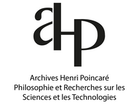
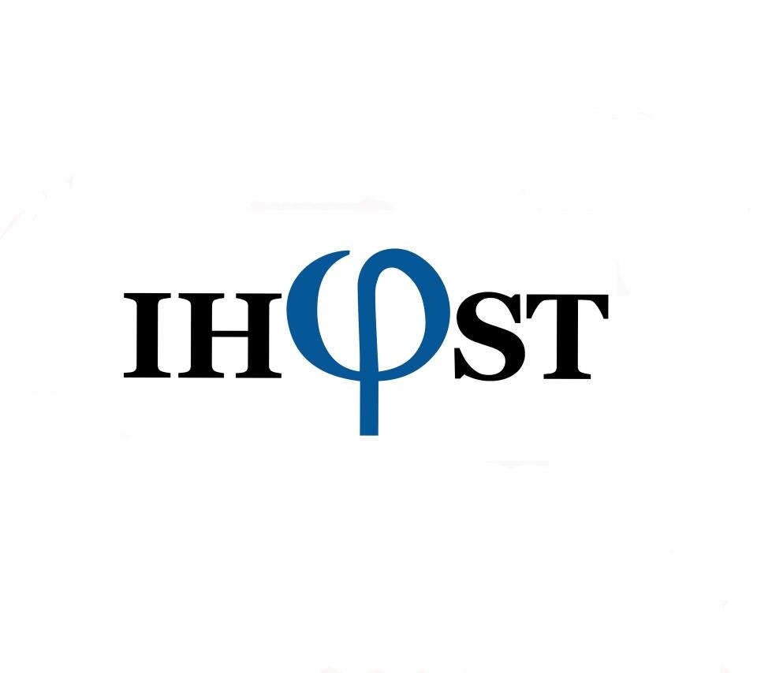
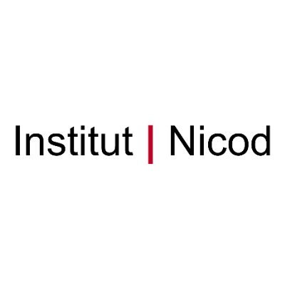
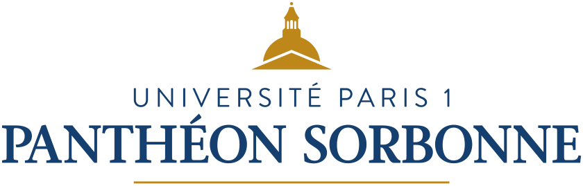
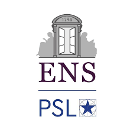

{:style="display:block; margin-left:auto; margin-right:auto" width="800"}

---

The **Paris-Nancy Colloquium in Logic and the Philosophy of Mathematics** or **PANALM** is a forum for general expository talks accessible and relevant for all researchers in logic and the philosophy of mathematics. Speakers are invited to describe a whole research line or program that they have been pursuing and present the main results they have obtained in a synoptic and didactic way. **PANALM** is run jointly by the [Institut d'Histoire et de Philosophie des Sciences et des Techniques (IHPST)](https://ihpst.pantheonsorbonne.fr/en) and the [Institut Jean Nicod (IJN)](http://www.institutnicod.org/?lang=en) in Paris and the [Archives Henri Poincaré (AHP)](https://poincare.univ-lorraine.fr/) in Nancy. Each of these institutions will welcome one session of PANALM per semester. PANALM is open to anyone interested, from students to researchers in neighboring disciplines.

 
  
  
  

---

## IJN Session Fall 2025: [Alexander Paseau (Oxford University)](https://www.philosophy.ox.ac.uk/people/alexander-paseau) - _September 30, 11AM_

**Title: _The Euclidean programme_**

**Abstract:** The Euclidean Programme embodies a traditional sort of epistemological foundationalism, according to which knowledge—especially mathematical knowledge—is obtained by deduction from self-evident axioms or first principles.  This talk, based on my book of the same name with Wesley Wrigley, will offer a detailed examination of Euclidean foundationalism, which, following Lakatos, we call the Euclidean Programme. In the talk, I will rationally reconstruct the programme’s key principles, showing it to be an epistemological interpretation of the axiomatic method. I will then assess the programme, exploring whether various areas of contemporary mathematics conform to it. 

**Location:** Salle de réunion de l’Institut Jean Nicod, Rez-de-chaussé, Pavillon Jardin, 29 rue d’Ulm, 75005 Paris

**Further reading:** No reading is required prior to the talk. However, if you would like to prepare for the talk or go deeper afterwards, you may consult:

Alexander Paseau and Wesley Wrigley (2024). [_The Euclidean Programme_](https://www.cambridge.org/core/books/euclidean-programme/EA733F22CAE537D1A42A8EF904600EEA), Cambridge University Press, Cambridge.

---

## AHP Session Fall 2025: [Sean Walsh (UCLA)](https://philosophy.ucla.edu/person/sean-walsh/) - _November 4, 2PM_

**Title: _Model completions, model theory, and ideal elements_**

**Abstract:** Manders (1989) suggested that the model-theoretic notion of model completion could help conceptualize the rationale behind the choice of ideal elements in mathematics. Bellomo (2021) usefully compares and contrasts this to the idea of 'domain expansion' that one finds in the principle of permanence, which has many connections to the Hilbert program (cf. Detlefsen 2005). The Hilbert program has given rise to much within mathematical logic, and can be viewed through the lens of reverse mathematics (Simpson 1988, Simpson 1999). In this talk, we look at Manders' preferred method of domain extension in the framework of reverse mathematics. It is one way of trying to understand how hard it is to find the types of models at issue in model completions when they exist.

**Location:** Amphithéâtre Léopold, Présidence Léopold, 34 cours Léopold, 54000 Nancy [link google maps](https://maps.app.goo.gl/osTEPMyUdzaf6cqz7)

**Further reading:** No reading is required prior to the talk. However, if you would like to prepare for the talk or go deeper afterwards, you may consult:

Bellomo, Anna, 2021. “Domain Extension and Ideal Elements in Mathematics.” _Philosophia Mathematica_, Series III 29 (3): 366–91.

Detlefsen, Michael, 2005. “Formalism.” In _The Oxford Handbook of Philosophy of Mathematics and Logic_, edited by Stewart Shapiro. Oxford University Press.

Manders, Kenneth, 1989. “Domain Extension and the Philosophy of Mathematics.” _The Journal of Philosophy_, 86 (10): 553–62.

S. G. Simpson, 1999. _Subsystems of Second Order Arithmetic. Perspectives in Mathematical Logic_. Springer- Verlag, Berlin.

S. G. Simpson, 1988. Partial realizations of Hilbert’s program. _Journal of Symbolic Logic_, 53(2):349–363.

---

## IHPST Session Fall 2025: [Aybüke Özgün (ILLC, University of Amsterdam)](https://sites.google.com/site/ozgunaybuke/) - _December 3, 11AM_

**Title: _TBA_**

**Abstract: _TBA_**

**Location: _TBA_**

---

# Registration

The seminar is free and without registration. Everyone interested is welcome to attend.

# Contact

For any questions, please send an email to the organizers.

# Organizers

- [Andrew Arana](https://aarana.github.io/) (Université de Lorraine, Archives Henri Poincaré)
- [Valeria Giardino](https://sites.google.com/view/valeriagiardino/home?pli=1) (CNRS, Institut Jean Nicod)
- [Yacin Hamami](https://www.yacinhamami.com/) (CNRS, Archives Henri Poincaré)
- [Francesca Poggiolesi](https://sites.google.com/site/poggiolesi/home) (CNRS, Institut d'Histoire et de Philosophie des Sciences et des Techniques)

# Acknowledgement and Support

The workshop is funded by by the [Institut d'Histoire et de Philosophie des Sciences et des Techniques (IHPST)](https://ihpst.pantheonsorbonne.fr/en), the [Institut Jean Nicod (IJN)](http://www.institutnicod.org/?lang=en) and the [Archives Henri Poincaré (AHP)](https://poincare.univ-lorraine.fr/).

  
  
  
  
  

  

  
  
  

